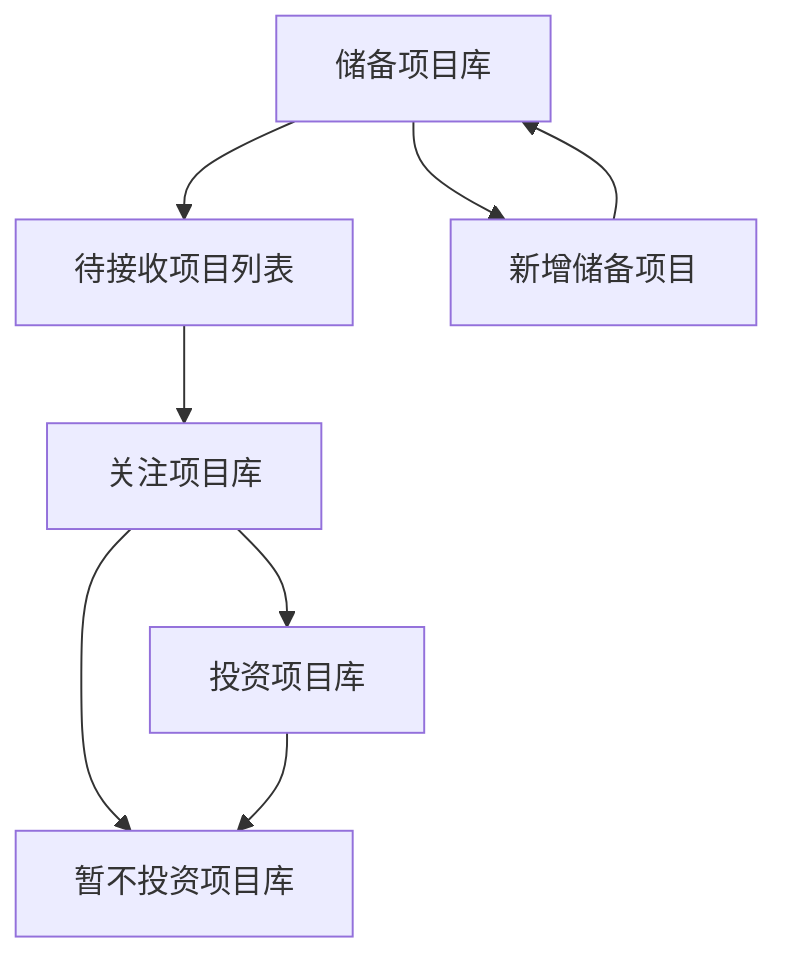

# 投资机构管理平台需求规格说明书

## 1. 文档信息

| 项目 | 内容 |
|------|------|
| 文档名称 | 投资机构管理平台需求规格说明书 |
| 版本号 | V1.0 |
| 编制日期 | 2026-03-04 |
| 编制部门 | 技术部 |
| 审批人 | - |

## 2. 需求概述

### 2.1 项目背景
投资机构在日常运营中需要对各类项目进行系统化管理，包括储备项目、待接收项目、关注项目、投资项目和暂不投资项目的全生命周期管理。为提高工作效率，规范项目管理流程，特开发此投资机构管理平台。

### 2.2 项目目标
- 实现项目全生命周期管理，从储备到投资的完整流程
- 提供直观的数据可视化和项目跟踪功能
- 优化投资决策流程，提高工作效率
- 确保数据安全和系统稳定

### 2.3 术语定义
| 术语 | 解释 |
|------|------|
| 储备项目 | 投资机构内部录入的潜在投资项目 |
| 待接收项目 | 外部推荐或系统分配的待处理项目 |
| 关注项目 | 已接收并进入跟踪阶段的项目 |
| 投资项目 | 已启动投决流程的项目 |
| 暂不投资项目 | 因各种原因暂时不进行投资的项目 |
| 投决 | 投资决策流程 |

## 3. 核心功能需求

### 3.1 功能模块划分

| 模块名称 | 功能描述 | 页面路径 |
|---------|---------|----------|
| 储备项目库管理 | 管理储备项目，支持新增、修改、删除、导出等操作 | /reserve |
| 待接收项目列表 | 处理外部推荐的项目，支持接受/拒绝操作 | /receive |
| 关注项目库管理 | 跟踪已接收项目，支持添加跟踪记录、启动投决等操作 | /follow |
| 投资项目库管理 | 管理已启动投决的项目，支持提交材料、终止投决等操作 | /invest |
| 暂不投资项目库管理 | 管理暂不投资的项目，支持筛选和查看 | /not-invest |
| 新增储备项目 | 分步表单录入新项目信息 | /add-project |
| 项目详情 | 查看项目详细信息和流转日志 | 弹窗 |
| 添加跟踪记录 | 为关注项目添加跟踪记录 | 弹窗 |
| 编辑项目详情 | 编辑项目基本信息 | 弹窗 |
| 接受项目 | 接受待接收项目并流转至关注库 | 弹窗 |
| 拒绝项目 | 拒绝待接收项目并退回至储备库 | 弹窗 |

### 3.2 详细功能需求

#### 3.2.1 储备项目库管理

**功能逻辑：**
- 展示储备项目列表，支持分页和筛选
- 支持按项目状态（全部/暂存/已提交/待补充）和行业分类筛选
- 支持新增储备项目
- 支持对项目进行查看、修改、删除、导出操作

**交互规则：**
- 点击左侧导航栏进入页面
- 点击筛选按钮切换筛选条件
- 点击"新增储备项目"按钮跳转到新增页面
- 点击"查看"按钮打开项目详情弹窗
- 点击"修改"按钮打开编辑项目详情弹窗
- 点击"删除"按钮确认后删除项目
- 点击"导出"按钮导出项目信息

**数据字段：**
- 项目编号：字符串
- 企业名称：字符串
- 所属地区：字符串
- 行业分类：字符串（制造业/信息技术/新能源）
- 项目类型：字符串（市场化类/政策引导类）
- 计划投资金额：数字（万元）
- 建设周期：字符串
- 项目状态：字符串（暂存/已提交/待补充）

#### 3.2.2 待接收项目列表

**功能逻辑：**
- 展示待接收项目列表
- 支持按项目名称、企业名称搜索
- 支持对项目进行查看、接受、拒绝操作

**交互规则：**
- 点击左侧导航栏进入页面
- 输入关键词点击搜索按钮进行搜索
- 点击"查看"按钮打开项目详情弹窗
- 点击"接受"按钮打开接受项目弹窗，填写接受意见并上传附件后确认接受
- 点击"拒绝"按钮打开拒绝项目弹窗，选择拒绝理由并填写意见后确认拒绝

**数据字段：**
- 项目名称：字符串
- 企业名称：字符串
- 所属地区：字符串
- 行业分类：字符串
- 推介时间：日期
- 推介理由：字符串
- 状态：字符串（待接收）

#### 3.2.3 关注项目库管理

**功能逻辑：**
- 展示关注项目列表
- 支持按项目名称、企业名称搜索
- 支持对项目进行查看、添加跟踪记录、启动投决、暂不投资操作

**交互规则：**
- 点击左侧导航栏进入页面
- 输入关键词点击搜索按钮进行搜索
- 点击"添加跟踪"按钮打开跟踪记录弹窗
- 点击"启动投决"按钮填写评估意见，项目流转至投资项目库
- 点击"暂不投资"按钮选择原因，项目流转至暂不投资库

**数据字段：**
- 项目名称：字符串
- 企业名称：字符串
- 所属行业：字符串
- 接收时间：日期
- 当前跟踪记录：字符串
- 跟踪人：字符串

#### 3.2.4 投资项目库管理

**功能逻辑：**
- 展示投资项目列表
- 支持按项目名称、企业名称搜索
- 支持对项目进行查看、提交材料、终止投决操作

**交互规则：**
- 点击左侧导航栏进入页面
- 输入关键词点击搜索按钮进行搜索
- 点击"提交材料"按钮上传投决所需材料
- 点击"终止投决"按钮填写原因，项目流转至暂不投资库

**数据字段：**
- 项目名称：字符串
- 企业名称：字符串
- 所属行业：字符串
- 流转时间：日期
- 当前投决阶段：字符串（投决中/已投资）

#### 3.2.5 暂不投资项目库管理

**功能逻辑：**
- 展示暂不投资项目列表
- 支持按来源（全部/来自关注库/来自投资库）和原因筛选
- 支持按日期范围筛选
- 支持对项目进行查看操作

**交互规则：**
- 点击左侧导航栏进入页面
- 点击筛选按钮切换筛选条件
- 选择日期范围点击筛选按钮进行时间筛选
- 点击"查看"按钮查看项目详情

**数据字段：**
- 项目名称：字符串
- 企业名称：字符串
- 所属行业：字符串
- 转入时间：日期
- 放弃原因摘要：字符串
- 来源：字符串（关注库/投资库）

#### 3.2.6 新增储备项目

**功能逻辑：**
- 分步表单录入项目信息
- 支持暂存和提交操作
- 支持从统一社会信用代码获取企业信息
- 支持上传附件

**交互规则：**
- 点击"新增储备项目"按钮进入页面
- 按步骤填写表单，点击"下一步"进入下一个步骤
- 点击"上一步"返回上一个步骤
- 点击"暂存"按钮保存草稿
- 点击"提交"按钮提交项目
- 点击"获取企业信息"按钮自动填充企业信息
- 点击文件上传区域选择文件上传

**数据字段：**
- 基本信息：项目名称、所属地区、行业分类、项目类型、计划投资金额、建设周期、申报筛选单位、是否市级重点项目、项目所处阶段
- 企业信息：企业名称、统一社会信用代码、成立时间、法定代表人、注册资本、经营状态、项目方联系人、联系电话、邮箱
- 项目详情：生产要素需求量化分析、项目简介
- 辅助材料：附件文件

#### 3.2.7 项目详情

**功能逻辑：**
- 展示项目详细信息
- 展示项目流转日志
- 支持查看附件

**交互规则：**
- 点击项目列表中的"查看"按钮打开详情弹窗
- 点击弹窗中的"关闭"按钮关闭弹窗
- 点击附件的"预览"或"下载"按钮操作附件

**数据字段：**
- 基本信息：项目编号、项目名称、所属地区、行业分类、项目类型、计划投资金额、建设周期、项目状态
- 企业信息：企业名称、统一社会信用代码、成立时间、法定代表人、注册资本、经营状态
- 项目详情：生产要素需求、项目简介
- 附件：文件名、文件大小
- 流转日志：日期、操作类型、内容、操作人、所属机构

#### 3.2.8 添加跟踪记录

**功能逻辑：**
- 录入跟踪记录信息
- 支持设置提醒时间

**交互规则：**
- 点击关注项目列表中的"添加跟踪"按钮打开跟踪记录弹窗
- 填写跟踪记录信息，点击"保存"按钮保存记录
- 点击"取消"按钮关闭弹窗

**数据字段：**
- 跟进日期：日期
- 跟进方式：字符串（电话/视频/实地）
- 参与人员：字符串
- 沟通内容：字符串
- 下一步计划：字符串
- 提醒时间：日期时间

#### 3.2.9 编辑项目详情

**功能逻辑：**
- 编辑项目基本信息
- 支持保存草稿和提交修改

**交互规则：**
- 点击项目列表中的"修改"按钮打开编辑项目详情弹窗
- 修改项目信息后，点击"保存草稿"按钮保存为草稿
- 点击"提交"按钮提交修改
- 点击"取消"按钮关闭弹窗

**数据字段：**
- 项目名称：字符串
- 所属地区：字符串
- 行业分类：字符串
- 项目类型：字符串
- 计划投资金额：数字
- 建设周期：字符串
- 项目简介：文本

#### 3.2.10 接受项目

**功能逻辑：**
- 接受待接收项目
- 填写接受意见
- 支持上传附件

**交互规则：**
- 点击待接收项目列表中的"接受"按钮打开接受项目弹窗
- 填写接受意见，可选择上传附件
- 点击"确认接受"按钮接受项目并流转至关注项目库
- 点击"取消"按钮关闭弹窗

**数据字段：**
- 接受意见：文本
- 附件：文件

#### 3.2.11 拒绝项目

**功能逻辑：**
- 拒绝待接收项目
- 选择拒绝理由
- 填写拒绝意见
- 支持上传附件

**交互规则：**
- 点击待接收项目列表中的"拒绝"按钮打开拒绝项目弹窗
- 选择拒绝理由，填写拒绝意见，可选择上传附件
- 点击"确认拒绝"按钮拒绝项目并退回至储备库
- 点击"取消"按钮关闭弹窗

**数据字段：**
- 拒绝理由：字符串（行业不符/投资规模不匹配/风险过高/其他）
- 拒绝意见：文本
- 附件：文件

## 4. UI/UX设计规范

### 4.1 布局规范

**整体布局：**
- 采用左侧固定侧边栏 + 右侧内容区的布局
- 左侧侧边栏宽度：200px
- 右侧内容区自适应宽度
- 页面最小宽度：1280px
- 页面最大宽度：1920px

**组件布局：**
- 顶部导航栏：高度60px，包含页面标题、搜索框、用户信息
- 页面头部：包含操作按钮和筛选栏
- 内容区域：包含卡片、表格、表单等组件
- 分页区域：位于页面底部，包含页码和每页显示条数选择

### 4.2 色彩规范

**主色调：**
- 氢氧蓝：#007AFF（主按钮、活跃状态、链接）
- 荧光青色：#00C7FF（辅助色）

**辅助色：**
- 成功：#34C759
- 警告：#FF9500
- 错误：#FF3B30
- 中性色：#C7C7CC（边框、分割线）
- 背景色：#F2F2F7（页面背景）、#FFFFFF（卡片背景）
- 文字色：#1C1C1E（主文字）、#8E8E93（辅助文字）

### 4.3 组件样式

**按钮：**
- 主按钮：蓝色背景，白色文字，圆角6px
- 次要按钮：白色背景，蓝色边框，圆角6px
- 危险按钮：红色背景，白色文字，圆角6px
- 小型按钮：高度32px，字体12px

**表格：**
- 表头背景：#F2F2F7
- 行高：22px
- 边框：1px solid #C7C7CC
- hover效果：背景色#F8F8F8

**表单：**
- 输入框：高度40px，圆角6px，边框1px solid #C7C7CC
- 标签：字体14px，字体权重500
- 文本域：高度100px，可垂直调整大小

**弹窗：**
- 最大宽度：800px
- 最大高度：80vh
- 头部背景：#E5F0FF
- 圆角：12px

**状态标签：**
- 暂存：灰色背景，白色文字
- 已提交：蓝色背景，白色文字
- 待补充：红色背景，白色文字
- 待接收：蓝色背景，白色文字
- 已投资：绿色背景，白色文字

### 4.4 响应式设计

- 适配1280-1920px屏幕宽度
- 在1921px以上屏幕，容器固定宽度1920px
- 左侧侧边栏固定，右侧内容区自适应
- 表格内容自动调整列宽

## 5. 非功能需求

### 5.1 浏览器兼容性
- 支持Chrome 90+、Firefox 88+、Safari 14+、Edge 90+浏览器
- 确保在不同浏览器中界面显示一致

### 5.2 性能要求
- 页面加载时间：≤ 3秒
- 操作响应时间：≤ 1秒
- 支持同时在线用户数：≥ 100人
- 数据处理能力：支持10000+项目数据

### 5.3 安全要求
- 数据传输采用HTTPS加密
- 权限控制：基于角色的访问控制
- 防止SQL注入、XSS等常见安全漏洞
- 定期数据备份

### 5.4 适配要求
- 支持1920x1080、1600x900、1366x768分辨率
- 支持Windows、macOS操作系统
- 响应式设计，适配不同屏幕尺寸

## 6. 数据说明

### 6.1 数据模型

**项目基本信息表**
| 字段名 | 数据类型 | 取值范围 | 说明 |
|-------|---------|---------|------|
| project_id | String | XMB+年月+序号 | 项目编号 |
| project_name | String | 255字符以内 | 项目名称 |
| region | String | 255字符以内 | 所属地区 |
| industry | String | 制造业/信息技术/新能源 | 行业分类 |
| project_type | String | 市场化类/政策引导类 | 项目类型 |
| investment_amount | Number | ≥ 0 | 计划投资金额（万元） |
| construction_cycle | String | 255字符以内 | 建设周期 |
| project_status | String | 暂存/已提交/待补充/待接收/关注中/投决中/已投资/暂不投资 | 项目状态 |
| create_time | Date | - | 创建时间 |
| update_time | Date | - | 更新时间 |

**企业信息表**
| 字段名 | 数据类型 | 取值范围 | 说明 |
|-------|---------|---------|------|
| company_id | String | - | 企业ID |
| company_name | String | 255字符以内 | 企业名称 |
| credit_code | String | 18位 | 统一社会信用代码 |
| establish_date | Date | - | 成立时间 |
| legal_person | String | 255字符以内 | 法定代表人 |
| registered_capital | String | 255字符以内 | 注册资本 |
| business_status | String | 255字符以内 | 经营状态 |
| contact_person | String | 255字符以内 | 项目方联系人 |
| contact_phone | String | 20字符以内 | 联系电话 |
| contact_email | String | 255字符以内 | 邮箱 |

**项目详情表**
| 字段名 | 数据类型 | 取值范围 | 说明 |
|-------|---------|---------|------|
| detail_id | String | - | 详情ID |
| project_id | String | - | 项目编号 |
| requirements | Text | - | 生产要素需求量化分析 |
| introduction | Text | 500字以内 | 项目简介 |

**附件表**
| 字段名 | 数据类型 | 取值范围 | 说明 |
|-------|---------|---------|------|
| attachment_id | String | - | 附件ID |
| project_id | String | - | 项目编号 |
| file_name | String | 255字符以内 | 文件名 |
| file_size | Number | - | 文件大小（字节） |
| file_path | String | - | 文件路径 |
| upload_time | Date | - | 上传时间 |

**跟踪记录表**
| 字段名 | 数据类型 | 取值范围 | 说明 |
|-------|---------|---------|------|
| tracking_id | String | - | 跟踪记录ID |
| project_id | String | - | 项目编号 |
| tracking_date | Date | - | 跟进日期 |
| tracking_method | String | 电话/视频/实地 | 跟进方式 |
| participants | String | 255字符以内 | 参与人员 |
| content | Text | - | 沟通内容 |
| next_plan | Text | - | 下一步计划 |
| reminder_time | Datetime | - | 提醒时间 |
| operator | String | 255字符以内 | 操作人 |
| create_time | Date | - | 创建时间 |

**流转日志表**
| 字段名 | 数据类型 | 取值范围 | 说明 |
|-------|---------|---------|------|
| log_id | String | - | 日志ID |
| project_id | String | - | 项目编号 |
| operate_time | Datetime | - | 操作时间 |
| operate_type | String | 提交/修改/接受/拒绝/启动投决/终止投决/暂不投资 | 操作类型 |
| content | Text | - | 操作内容 |
| operator | String | 255字符以内 | 操作人 |
| organization | String | 255字符以内 | 所属机构 |

### 6.2 数据流程图

## 7. 交付物清单

### 7.1 前端交付物

| 交付物名称 | 说明 | 路径 |
|-----------|------|------|
| 首页 | 投资机构管理平台主页面 | index.html |
| 样式文件 | 平台样式定义 | style.css |
| 脚本文件 | 平台交互逻辑 | script.js |
| 需求规格说明书 | 项目需求文档 | 投资机构管理平台需求规格说明书.md |

### 7.2 预览方式
- 直接打开index.html文件即可预览
- 建议使用Chrome浏览器以获得最佳体验

### 7.3 部署要求
- 部署到Web服务器根目录
- 确保服务器支持静态文件访问
- 配置HTTPS以保证数据安全
- 定期备份数据文件

### 7.4 技术栈
- 前端：HTML5、CSS3、JavaScript
- 无需后端服务，纯前端实现
- 支持本地存储数据

## 8. 验收标准

1. **功能完整性**：所有功能模块均已实现，符合需求规格说明书中的描述
2. **界面美观**：符合UI/UX设计规范，界面美观、易用
3. **响应速度**：页面加载和操作响应时间符合性能要求
4. **兼容性**：在指定浏览器中正常运行
5. **数据准确性**：数据展示和操作结果准确无误
6. **安全性**：无明显安全漏洞

---

**文档结束**